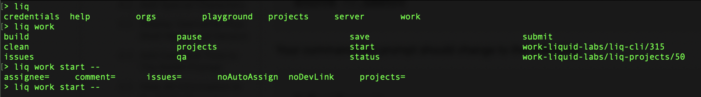

# liq-cli

**_<span style="color:red">This is an alpha project.</span> Documentation and implementation may not be entirely in-sync._**

This is the command line interface to liq. liq is a modular, user-friendly development and process management framework. Some key modules include:

- policy-aware software change control (for developers),
- project best-practices setup and enforcement (for developers),
- project CI/CD support (for devops),
- self-adapting and fully tailored company policy (for HR and compliance),
- policy training and awareness tools (for HR),
- internal audits (for security and compliance),
- comprehensive compliance tools (for security and compliance),
- contract management (for legal and HR),

___

* [Installation and setup](#installation-and-setup)
* [Navigation and help](#navigation-and-help)
  * [Command sequence and parameters](#command-sequence-and-parameters)
  * [Tab completion is your friend](#tab-completion-is-your-friend)
  * [Getting help](#getting-help)
* [Platform support](#platform-support)
* [Contributions and bounties](#contributions-and-bounties)
* [Further reading](#further-reading)

# Installation and setup

If you have global install access:
`npm install --omit=dev -g @liquid-labs/liq-cli`

To setup 'global' installation under your user directory (in bash or zsh):
```bash
mkdir -p "${HOME}/.npm-local/bin"
npm config set prefix "${HOME}/.npm-local/"
# instead of the following, you can use an editor to modify the existing PATH settings
[[ $SHELL =~ '/zsh$' ]] && SHELL_FILE=.zshenv \
  || { [[ $SHELL =~ '/bash$' ]] && SHELL_FILE=.bashrc; } \
  || echo 'Sorry, your shell is not recognized. Add ~/.npm-local/bin to the appropriate setup file'
[[ -n "$SHELL_FILE" ]] \
  && echo 'export PATH=${HOME}/.npm-local/bin/:$PATH' >> "${HOME}/${SHELL_FILE}" \
  && source "${HOME}/${SHELL_FILE}"
unset SHELL_FILE
# now you can run the 'global' installation
npm install --omit=dev -g @liquid-labs/liq-cli
```

Then, simply run:
```bash
liq setup
```

This will walk you through local configuration settings, install `@liquid-labs/liq-core`, and setup tab completion for bash and zsh shells. See [Managing plugins](#managing-plugins) for next steps.

## Navigation and help

### Command sequence and parameters

Each liq command consists of a command sequence and zero or more parameters. The command sequence and parameters are separated by '--'. Parameters are in the form of `X=Y`. A bare parameter `X` is equivalent to `X=true`. E.g.:
```bash
liq work save -- summary='Fixed null pointer' dirtyOK
#   |---v---| || |--------------v-----------| |--v--|
#cmd sequence v   parameter with string value  boolean 'TRUE' parameter
        param seperator
```

### Tab completion is your friend

liq employs comprehensive **tab completion** so you can always hit `<TAB><TAB>` to get a list of options. You can see here the results for tab completion on each line:



### Getting help

You can either prefix any command sequence with 'help' or you can add a 'help' parameter to any command. The latter 'help option' form is useful if you've constructed a long command but want to double check the expected behavior. E.g., the following ar equivalent:
```bash
liq help work start
liq work start -- help
```

## Managing plugins

The core system doesn't do much on it's own, and you will want to add plugins. The 'standard' group of plugins is a good place to start for most users:
```
liq plugins add -- groups=standard
```

- `liq help plugins` : Displays an overview of plugin management commands.
- `liq plugins list` : Will list installed plugins.
- `liq plugins list -- available` : Will list available plugins and plugin groups.
- `liq plugins add -- groups=XXX` : Adds/installs a plugin group. You can repeat the `groups` option to install multiple plugin groups at one time.
- `liq plugins add -- plugins=XXX` : Adds/installs specific plugins. You can repeat the `plugins` option to install multiple plugins at one time.
- `liq plugins XXX detail` : Provides detailed information about the named plugin. You can use tab completion to get a list of available plugin names.
- `liq plugins XXX remove` : Removes/uninstalls the named plugin.

## Platform support

* MacOS is the primary/lead platform and fully supported.
* Linux is supported, though testing is not currently robust as Mac.
* BSD is supported, though testing is not currently robust as Mac.
* Windows will be supported in the 1.0 gold release, but is not currently supported. This is an area where [contributions](#contributions-and-bounties) are greatly appreciated.

# Contributions and bounties

This project offers bounties on many issues.

* [Search for available bounty tasks in this project](https://github.com/liquid-labs/liq-cli/issues?utf8=%E2%9C%93&q=is%3Aissue+is%3Aopen+no%3Aassignee+label%3Abounty) or [all Liquid Labs bounty tasks](https://github.com/issues?utf8=%E2%9C%93&q=is%3Aopen+is%3Aissue+org%3Aliquid-labs+archived%3Afalse+label%3Abounty).
* Refer to [Contributions and Bounties](/docs/Contributions%20and%20Bounties.md).
* Claim a bounty!

Non-bounty contributions are also welcome. You may also refer to open, non-bountied issues and make an offer.

# Further reading

For a more detailed look at liq, please refer to the [project documentation](/docs/toc.md).
